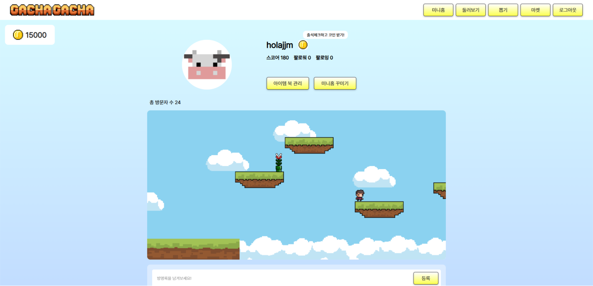
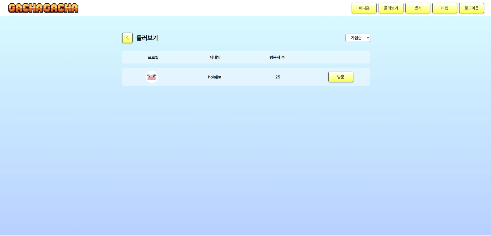
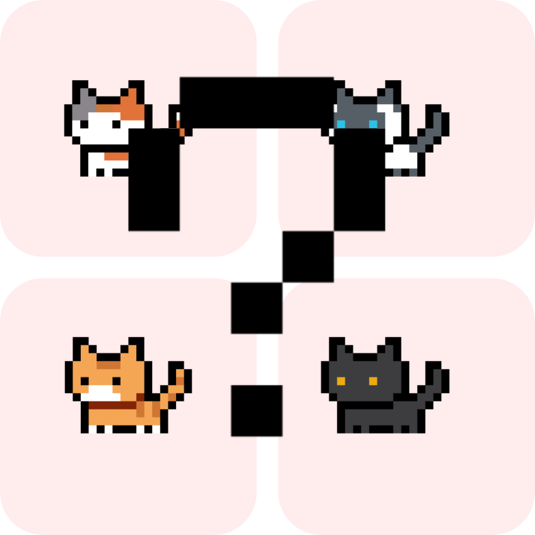
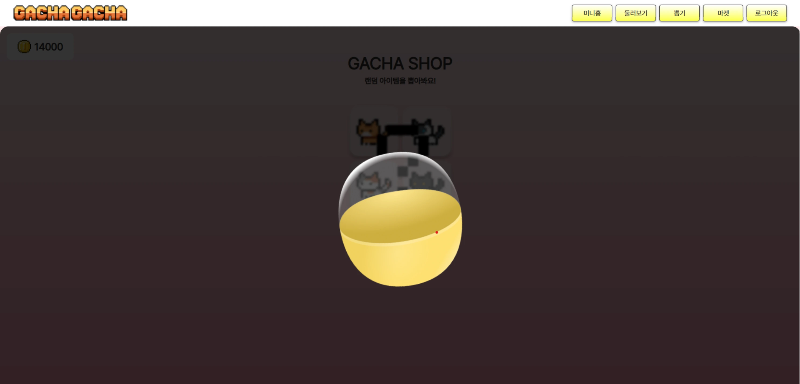
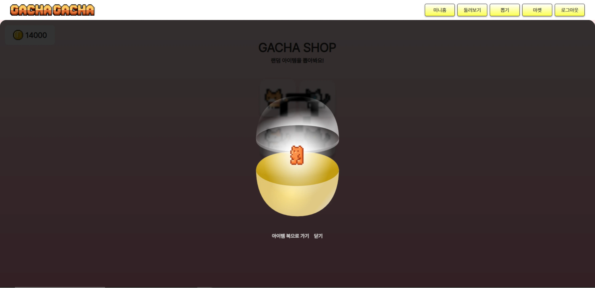
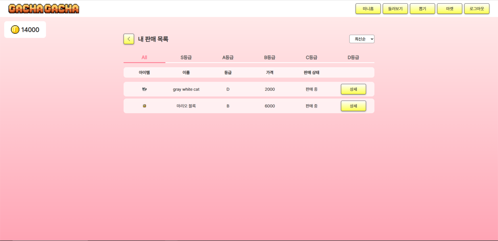
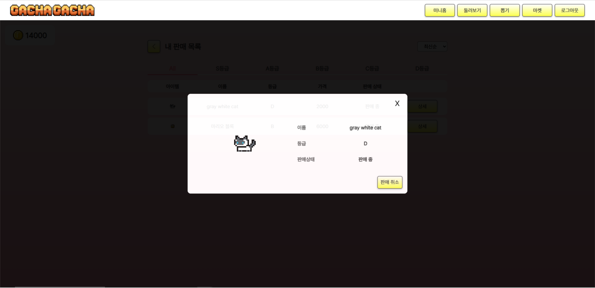
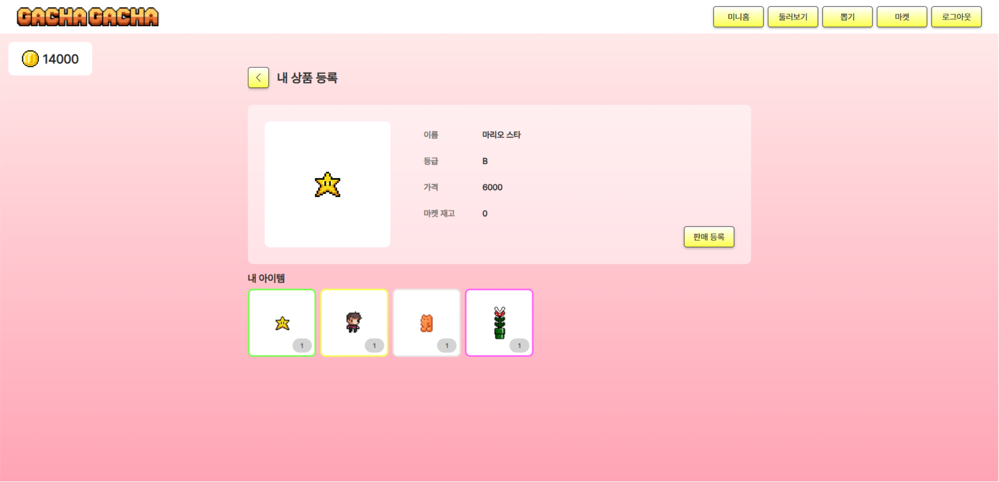

<h1 align="center">가챠가챠(GachaGacha)</h1>
</br>

<p align="center">


</br>

## 1. 프로젝트 소개

> "가챠를 통해 아이템을 뽑고, 내 미니홈을 꾸며보아요!"

- 이전의 싸이월드 미니홈피와 일본의 가챠샵을 접목하여 구현한 프로젝트로, 가챠를 통해 뽑은 아이템을 활용하여 개인 미니홈을 꾸미고, 아이템을 사고 팔 수 있는 서비스입니다.

</br>

> ### 배포 링크 및 테스트 계정

👉🏻 [GachaGacha](https://gacha-ruddy.vercel.app/, "바로가기")

</br>

> ### 개발 기간

- 2024.12 ~ 2025.03
  </br>

> ### 사용 기술

<div>
  
  
  
  
  
</br> 
  
  
  
  
  
</div>
<div>
  
  
</div>

  </br>

## 2.팀 소개

<table>
  <tbody>
    <tr>
      <td align="center"><a href="https://github.com/olsohee"><br /><sub><b>BE 이소희</b></sub></a><br /></td>
      <td align="center"><a href="https://github.com/holajjm"><br /><sub><b>FE 정종민</b></sub></a><br /></td>
     </tr>
  </tbody>
</table>


## 3. 세부 역할**

### 💜 정종민

> **공통 컴포넌트 작성 & 커스텀 훅 생성**
> **공통 컴포넌트 작성 & 커스텀 훅 생성**
> **공통 컴포넌트 작성 & 커스텀 훅 생성**
> **공통 컴포넌트 작성 & 커스텀 훅 생성**


> **⚙️ 공통 컴포넌트 작성 & 커스텀 훅 생성**

- 공통 컴포넌트 개발
  - `DetailPageHeader` 작성
  - `useCustomAxios` 작성
  - 리드미 작성
    <br />

> **UI 구현**

#### 커뮤니티 메인 화면

- 인기 포스팅 출력 화면
- 게시글 목록 렌더링 화면

#### 게시글 작성 화면

- 게시글 작성 영역
- 날씨 이모티콘 선택 버튼 영역
- 파일 첨부 영역

#### 게시글 상세 조회 화면

- 댓글 리스트 영역 출력 화면
- 상세 댓글

<br/>

> **기능 구현**

#### 커뮤니티 메인 페이지

- 각 게시글의 조회 수가 높은 순서대로 인기 게시물 출력
- 각 게시글의 조회 수 및 날씨 정보, 댓글 수,글 내용, 첨부 사진 출력
- 특정 게시글의 내용 검색 시 검색 기능

#### 커뮤니티 게시글 상세 조회 페이지

- 게시글의 조회 수, 댓글 수, 작성 시간 정보 출력
- 게시글에 작성자 유효성 검사를 통한 삭제 기능 제한적 구현

#### 커뮤니티 게시글 작성 페이지

- 게시글 작성 시 이미지 파일 첨부 기능
- 게시글 작성 시 날씨에 따른 이모티콘 설정 후 날씨 정보 첨부 기능
- 게시글 내용 작성 기능

#### 댓글 작성 기능

- 특정 게시글에 댓글 등록 기능 구현
- 댓글 작성 시 작성자 정보, 작성 시간, 댓글 내용 출력 구현
- 댓글 작성자 유효성 검사를 통해 삭제 기능 제한적 구현

#### 마이페이지 작성 글 조회

- 특정 유저가 본인이 작성한 글 조회 기능 구현


## 4. 프로젝트 폴더 구조

```
📦GachaGacha
 ┣ 📂public
 ┣ 📂src
 ┃ ┣ 📂assets
 ┃ ┣ 📂api
 ┃ ┣ 📂components
 ┃ ┃ ┣ 📂layouts
 ┃ ┃ ┃ ┣ 📜Footer.tsx
 ┃ ┃ ┃ ┣ 📜Header.tsx
 ┃ ┃ ┃ ┗ 📜Index.tsx
 ┃ ┃ ┣ 📂modals
 ┃ ┃ ┃ ┣ 📜MarketItemModal.tsx
 ┃ ┃ ┃ ┣ 📜MarketSellingItemModal.tsx
 ┃ ┃ ┃ ┣ 📜MinihomeFollowerModal.tsx
 ┃ ┃ ┃ ┃ 📜MinihomeFollowingModal.tsx
 ┃ ┃ ┃ ┗ 📜PreviewModal.tsx
 ┃ ┃ ┣ 📂skeleton
 ┃ ┃ ┃ ┣ 📜MinihomeAdornItemSkeleton.tsx
 ┃ ┃ ┃ ┗ 📜MinihomeItemSkeleton.tsx
 ┃ ┃ ┣ 📜Bell.tsx
 ┃ ┃ ┣ 📜BellItem.tsx
 ┃ ┃ ┣ 📜BellItems.tsx
 ┃ ┃ ┣ 📜Button.tsx
 ┃ ┃ ┣ 📜Coin.tsx
 ┃ ┃ ┣ 📜Loading.tsx
 ┃ ┃ ┣ 📜Lotto.tsx
 ┃ ┃ ┗ 📜LottoOpen.tsx
 ┃ ┣ 📂constants
 ┃ ┃ ┣ 📜.env
 ┃ ┃ ┗ 📜Profile.ts
 ┃ ┣ 📂hooks
 ┃ ┃ ┣ 📜ModalPortal.ts
 ┃ ┃ ┣ 📜useCustomAxios.tsx
 ┃ ┃ ┣ 📜useImage.tsx
 ┃ ┃ ┣ 📜usePageTitle.tsx
 ┃ ┃ ┣ 📜usePageUpper.tsx
 ┃ ┃ ┗ 📜useSSE.ts
 ┃ ┣ 📂pages
 ┃ ┃ ┣ 📂Explore
 ┃ ┃ ┃ ┣ 📜ExploreItem.tsx
 ┃ ┃ ┃ ┗ 📜ExploreMain.tsx
 ┃ ┃ ┣ 📂Gacha
 ┃ ┃ ┃ ┣ 📜GachaCapsule.tsx
 ┃ ┃ ┃ ┣ 📜GachaCloseCapsule.tsx
 ┃ ┃ ┃ ┣ 📜GachaMain.tsx
 ┃ ┃ ┃ ┗ 📜GachaOpenCapsule.tsx
 ┃ ┃ ┣ 📂Main
 ┃ ┃ ┃ ┣ 📜MainExplorePreview.tsx
 ┃ ┃ ┃ ┣ 📜MainGachaPreview.tsx
 ┃ ┃ ┃ ┣ 📜MainMarketPreview.tsx
 ┃ ┃ ┃ ┣ 📜MainMiniHomePreview.tsx
 ┃ ┃ ┃ ┣ 📜MainPage.tsx
 ┃ ┃ ┃ ┗ 📜MainTitle.tsx
 ┃ ┃ ┣ 📂Market
 ┃ ┃ ┃ ┣ 📂Enroll
 ┃ ┃ ┃ ┃ ┣ 📜MarketEnroll.tsx
 ┃ ┃ ┃ ┃ ┣ 📜MarketEnrollItem.tsx
 ┃ ┃ ┃ ┃ ┗ 📜MarketEnrollPreview.tsx
 ┃ ┃ ┃ ┣ 📂Sell
 ┃ ┃ ┃ ┃ ┣ 📜MarketMySellingItem.tsx
 ┃ ┃ ┃ ┃ ┗ 📜MarketMySellingList.tsx
 ┃ ┃ ┃ ┣ 📜MarketItem.tsx
 ┃ ┃ ┃ ┗ 📜MarketMain.tsx
 ┃ ┃ ┣ 📂Minihome
 ┃ ┃ ┃ ┣ 📂Adorn
 ┃ ┃ ┃ ┃ ┣ 📜MinihomeAdorn.tsx
 ┃ ┃ ┃ ┃ ┣ 📜MinihomeAdornBackground.tsx
 ┃ ┃ ┃ ┃ ┣ 📜MinihomeAdornBackgroundItem.tsx
 ┃ ┃ ┃ ┃ ┣ 📜MinihomeAdornDraggableItem.tsx
 ┃ ┃ ┃ ┃ ┣ 📜MinihomeAdornEdit.tsx
 ┃ ┃ ┃ ┃ ┣ 📜MinihomeAdornEditDraggableItem.tsx
 ┃ ┃ ┃ ┃ ┣ 📜MinihomeAdornItem.tsx
 ┃ ┃ ┃ ┃ ┗ 📜MinihomeAdornItemList.tsx
 ┃ ┃ ┃ ┣ 📂Header
 ┃ ┃ ┃ ┃ ┣ 📜MinihomeFollowerItem.tsx
 ┃ ┃ ┃ ┃ ┣ 📜MinihomeFollowingItem.tsx
 ┃ ┃ ┃ ┃ ┗ 📜MinihomeHeader.tsx
 ┃ ┃ ┃ ┣ 📂ItemBook
 ┃ ┃ ┃ ┃ ┣ 📜MinihomeItemBook.tsx
 ┃ ┃ ┃ ┃ ┗ 📜MinihomeItems.tsx
 ┃ ┃ ┃ ┣ 📂Reply
 ┃ ┃ ┃ ┃ ┣ 📜MinihomeReplyEdit.tsx
 ┃ ┃ ┃ ┃ ┣ 📜MinihomeReplyItem.tsx
 ┃ ┃ ┃ ┃ ┗ 📜MinihomeReplyNew.tsx
 ┃ ┃ ┃ ┣ 📜MiniHomeItem.tsx
 ┃ ┃ ┃ ┗ 📜MiniHomeMain.tsx
 ┃ ┃ ┣ 📂User
 ┃ ┃ ┃ ┣ 📜UserEdit.tsx
 ┃ ┃ ┃ ┣ 📜UserJoin.tsx
 ┃ ┃ ┃ ┗ 📜UserLogin.tsx
 ┃ ┃ ┃ 📜ErrorPage.tsx
 ┃ ┃ ┗ 📜OAuth.tsx
 ┃ ┣ 📂store
 ┃ ┃ ┗ 📜store.ts
 ┃ ┣ 📂styles
 ┃ ┃ ┣ 📂Explore
 ┃ ┃ ┃ ┣ 📜ExploreItem.module.css
 ┃ ┃ ┃ ┗ 📜ExploreMain.module.css
 ┃ ┃ ┣ 📂Gacha
 ┃ ┃ ┃ ┣ 📜GachaCapsule.module.css
 ┃ ┃ ┃ ┣ 📜GachaCloseCapsule.module.css
 ┃ ┃ ┃ ┣ 📜GachaMain.module.css
 ┃ ┃ ┃ ┗ 📜GachaOpenCapsule.module.css
 ┃ ┃ ┣ 📂Layouts
 ┃ ┃ ┃ ┣ 📂modals
 ┃ ┃ ┃ ┃ ┣ 📜MarketItemModal.module.css
 ┃ ┃ ┃ ┃ ┣ 📜MarketSellingItemModal.module.css
 ┃ ┃ ┃ ┃ ┗ 📜MinihomeFollowModal.module.css
 ┃ ┃ ┃ ┣ 📂skeleton
 ┃ ┃ ┃ ┃ ┣ 📜MinihomeAdornItemSkeleton.module.css
 ┃ ┃ ┃ ┃ ┗ 📜MinihomeItemSkeleton.module.css
 ┃ ┃ ┃ ┣ 📜Bell.module.css
 ┃ ┃ ┃ ┣ 📜BellItems.module.css
 ┃ ┃ ┃ ┣ 📜Button.module.css
 ┃ ┃ ┃ ┣ 📜Coin.module.css
 ┃ ┃ ┃ ┣ 📜Footer.module.css
 ┃ ┃ ┃ ┣ 📜Header.module.css
 ┃ ┃ ┃ ┣ 📜Loading.module.css
 ┃ ┃ ┃ ┗ 📜Lotto.module.css
 ┃ ┃ ┣ 📂Main
 ┃ ┃ ┃ ┗ 📜MainPage.module.css
 ┃ ┃ ┣ 📂Market
 ┃ ┃ ┃ ┣ 📂Enroll
 ┃ ┃ ┃ ┃ ┣ 📜MarketEnroll.module.css
 ┃ ┃ ┃ ┃ ┣ 📜MarketEnrollItem.module.css
 ┃ ┃ ┃ ┃ ┗ 📜MarketEnrollPreview.module.css
 ┃ ┃ ┃ ┣ 📂Sell
 ┃ ┃ ┃ ┃ ┣ 📜MarketMySellingItem.module.css
 ┃ ┃ ┃ ┃ ┗ 📜MarketMySellingList.module.css
 ┃ ┃ ┃ ┣ 📜MarketItem.module.css
 ┃ ┃ ┃ ┗ 📜MarketMain.module.css
 ┃ ┃ ┣ 📂Minihome
 ┃ ┃ ┃ ┣ 📂Adorn
 ┃ ┃ ┃ ┃ ┣ 📜MinihomeAdorn.module.css
 ┃ ┃ ┃ ┃ ┣ 📜MinihomeAdornBackground.module.css
 ┃ ┃ ┃ ┃ ┣ 📜MinihomeAdornBackgroundItem.module.css
 ┃ ┃ ┃ ┃ ┣ 📜MinihomeAdornDraggableItem.module.css
 ┃ ┃ ┃ ┃ ┗ 📜MinihomeAdornItemList.module.css
 ┃ ┃ ┃ ┣ 📂Header
 ┃ ┃ ┃ ┃ ┣ 📜MinihomeFollowItem.module.css
 ┃ ┃ ┃ ┃ ┗ 📜MinihomeHeader.module.css
 ┃ ┃ ┃ ┣ 📂ItemBook
 ┃ ┃ ┃ ┃ ┣ 📜MinihomeItemBook.module.css
 ┃ ┃ ┃ ┃ ┗ 📜MinihomeItems.module.css
 ┃ ┃ ┃ ┣ 📂Reply
 ┃ ┃ ┃ ┃ ┣ 📜MinihomeReplyEdit.module.css
 ┃ ┃ ┃ ┃ ┣ 📜MinihomeReplyItem.module.css
 ┃ ┃ ┃ ┃ ┗ 📜MinihomeReplyNew.module.css
 ┃ ┃ ┃ ┣ 📜MiniHomeItem.module.css
 ┃ ┃ ┃ ┗ 📜MiniHomeMain.module.css
 ┃ ┃ ┣ 📂User
 ┃ ┃ ┃ ┣ 📜UserEdit.module.css
 ┃ ┃ ┃ ┣ 📜UserJoin.module.css
 ┃ ┃ ┃ ┗ 📜UserLogin.module.css
 ┃ ┃ ┃ 📜ErrorPage.module.css
 ┃ ┃ ┗ 📜OAuth.module.css
 ┃ ┣ 📂types
 ┃ ┃ ┣ 📜components.ts
 ┃ ┃ ┣ 📜explore.ts
 ┃ ┃ ┣ 📜market.ts
 ┃ ┃ ┣ 📜minihome.ts
 ┃ ┃ ┗ 📜user.ts
 ┃ ┣ 📜App.css
 ┃ ┣ 📜App.tsx
 ┃ ┣ 📜event-source-polyfill.d.ts
 ┃ ┣ 📜index.css
 ┃ ┣ 📜main.tsx
 ┃ ┃ 📜routes.tsx
 ┃ ┗ 📜vite-env.d.ts
 ┣ 📜.gitignore
 ┣ 📜.prettierrc.cjs
 ┣ 📜eslint.config.js
 ┣ 📜index.html
 ┣ 📜package-lock.json
 ┣ 📜package.json
 ┣ 📜README.md
 ┣ 📜tsconfig.app.json
 ┣ 📜tsconfig.json
 ┣ 📜tsconfig.node.json
 ┣ 📜vercel.json
 ┗ 📜vite.config.ts
```

<!-- ------------------------------------------------------------------------------------------------------------------ -->

## 5. UI 미리보기

### 웹 버전

|                  메인 화면 - 로그인 전                   |                  메인 화면 - 로그인 후                   |
| :---------------------------------------------------: | :----------------------------------------------------: |
|  |  |

|                    미니홈 - 메인                        |                      미니홈 - 댓글                      |
| :---------------------------------------------------: | :----------------------------------------------------: |
|  |  |

|                    미니홈 - 아이템 북                   |                    미니홈 - 꾸미기(1)                    |
| :---------------------------------------------------: | :----------------------------------------------------: |
|  |  |

|                    미니홈 - 꾸미기(2)                   |                      둘러보기 - 메인                     |
| :---------------------------------------------------: | :----------------------------------------------------: |
|  |  |

|                     가챠 - 메인                        |                      가챠 - 뽑는중                      |
| :---------------------------------------------------: | :---------------------------------------------------: |
|  |  |

|                     가챠 - 뽑기 완료                    |                      마켓 - 메인                       |
| :---------------------------------------------------: | :---------------------------------------------------: |
|  |  |

|                       마켓 - 판매중인 아이템                      |                   마켓 - 내 판매 목록                 |
| :---------------------------------------------------: | :---------------------------------------------------: |
|  |  |

|                  마켓 - 내 판매 목록 상세                |                     마켓 - 판매 등록                    |
| :---------------------------------------------------: | :---------------------------------------------------: |
|  |  |

<!-- ### 모바일 버전

|                        시작 화면                         |                        메인 화면                         |                  메인 화면 - 전국 날씨                   |
| :------------------------------------------------------: | :------------------------------------------------------: | :------------------------------------------------------: |
|  |  |  |

|                메인 화면 - 추천 장소 상세                |               메인 화면 - 날씨 성격 테스트               |                       로그인 화면                        |
| :------------------------------------------------------: | :------------------------------------------------------: | :------------------------------------------------------: |
|  |  |  |

|                   커뮤니티 - 메인화면                    |                커뮤니티 - 게시글 상세보기                |                  장소 추천 - 메인 화면                   |
| :------------------------------------------------------: | :------------------------------------------------------: | :------------------------------------------------------: |
|  |  |  |

|                        마이페이지                        |            카테고리 - 상세 내용            |            카테고리 - 상세 내용            |
| :------------------------------------------------------: | :----------------------------------------: | :----------------------------------------: |
|  |  |  |

## 6. 기능 소개 -->
